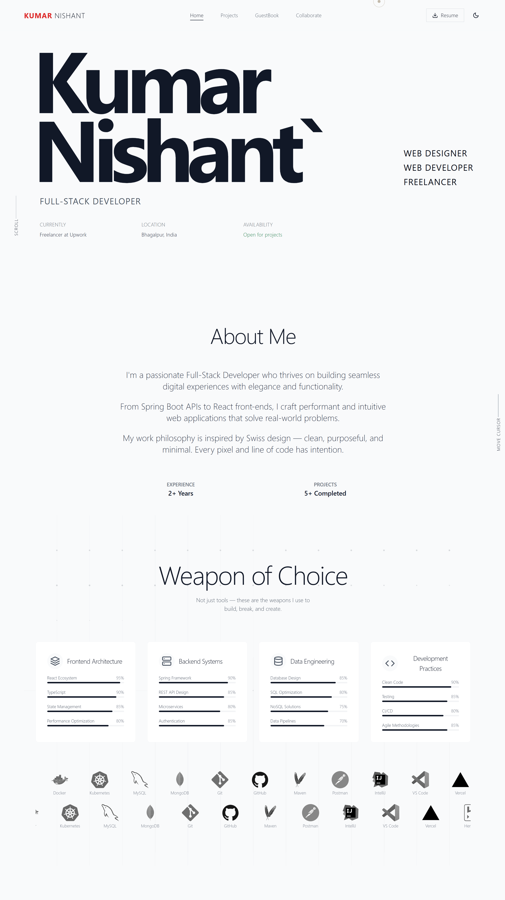
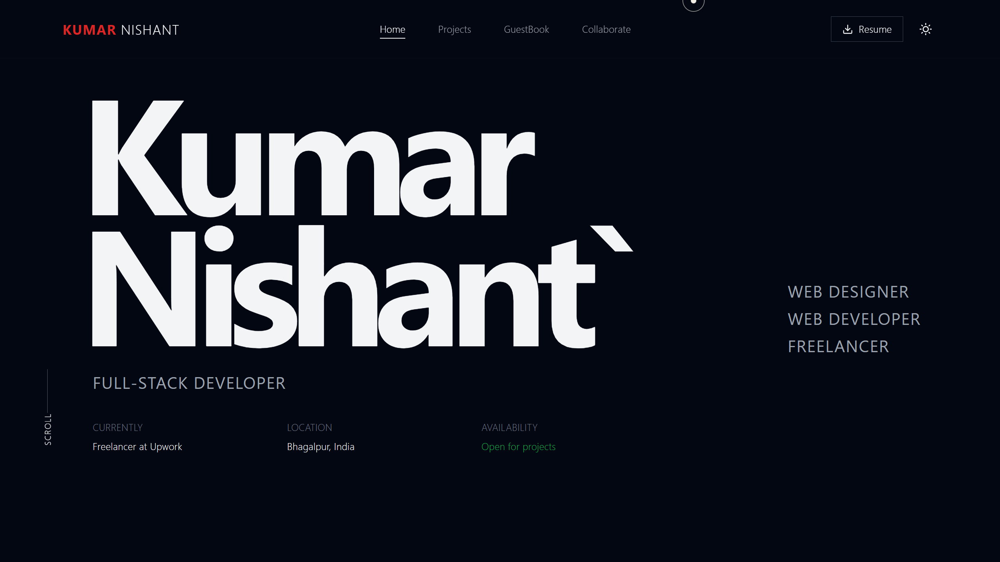

<h1 align="center">✨ Nishant's Portfolio ✨</h1>

<p align="center">
  <b>Modern. Minimal. Memorable.</b><br/>
  <i>Showcasing creativity, code, and career in one place.</i>
</p>

<p align="center">
  
  
  
  
</p>

---

<p align="center">
  
   
  
</p>

---

## ✨ Overview

A modern, minimalist portfolio website built with <b>React</b>, <b>TypeScript</b>, and <b>Tailwind CSS</b>. Inspired by Swiss design, it features clean typography, generous whitespace, and purposeful interactions. Perfect for developers, designers, and creatives who want to stand out.

---

## 🎯 Features

- 🌗 <b>Dark/Light Theme</b> — Persistent, smooth transitions
- 🖱️ <b>Custom Cursor</b> — Interactive, animated cursor
- 🎬 <b>GSAP Animations</b> — Smooth, performant transitions
- 🧭 <b>Multi-page App</b> — React Router navigation
- 🖼️ <b>Project Gallery</b> — Showcase your best work
- 💬 <b>GuestBook</b> — Collect testimonials
- 🤝 <b>Collaboration Form</b> — Easy project inquiries
- 🎵 <b>Background Music</b> — Ambient music with mute toggle
- 📱 <b>Fully Responsive</b> — Looks great on any device

---

## 🛠️ Tech Stack

- <b>React 18</b> + <b>TypeScript</b>
- <b>Tailwind CSS</b>
- <b>React Router DOM</b>
- <b>GSAP</b> & <b>ScrollTrigger</b>
- <b>Lenis</b> (smooth scrolling)
- <b>Lucide React</b>, <b>React Icons</b>

---

## 🗂️ Project Structure

```text
src/
├── components/    # Reusable UI components
├── pages/         # Page components
├── context/       # React context providers
├── App.tsx        # Main app
├── main.tsx       # Entry point
└── index.css      # Global styles
```

---

## ⚡ Quick Start

```bash
# 1. Install dependencies
npm install

# 2. Start the development server
npm run dev

# 3. Build for production
npm run build

# 4. Lint your code
npm run lint
```


---


<p align="center">
  <b>Made with ❤️ by <a href="https://github.com/K-Nishant-18">Kumar Nishant</a></b>
</p> 
